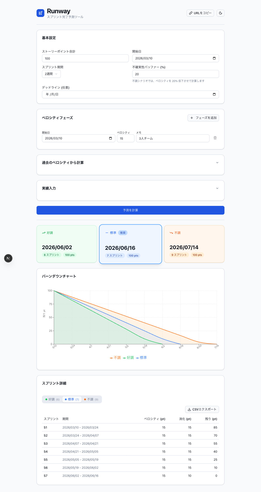
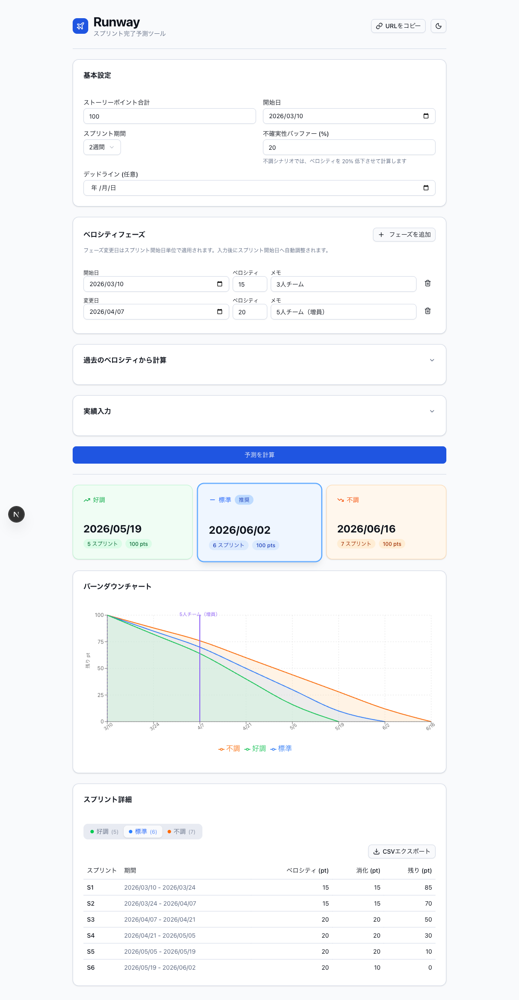
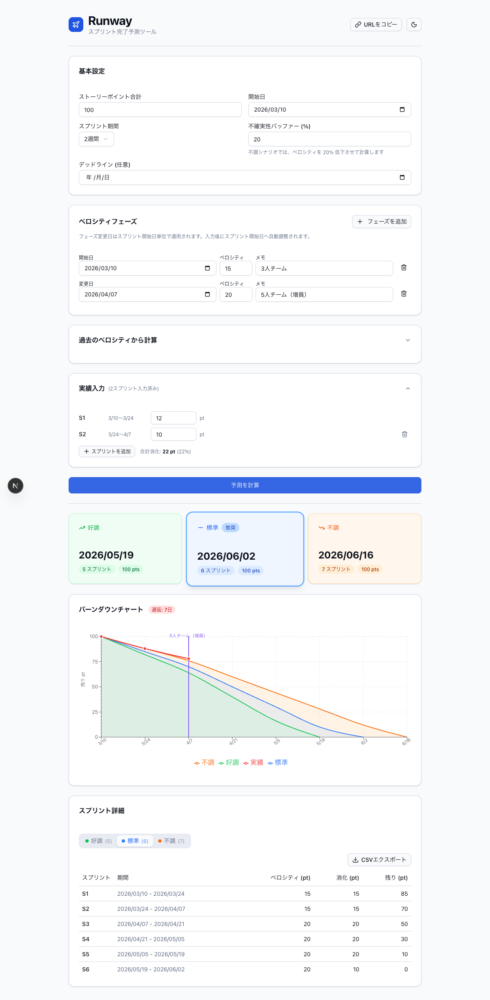
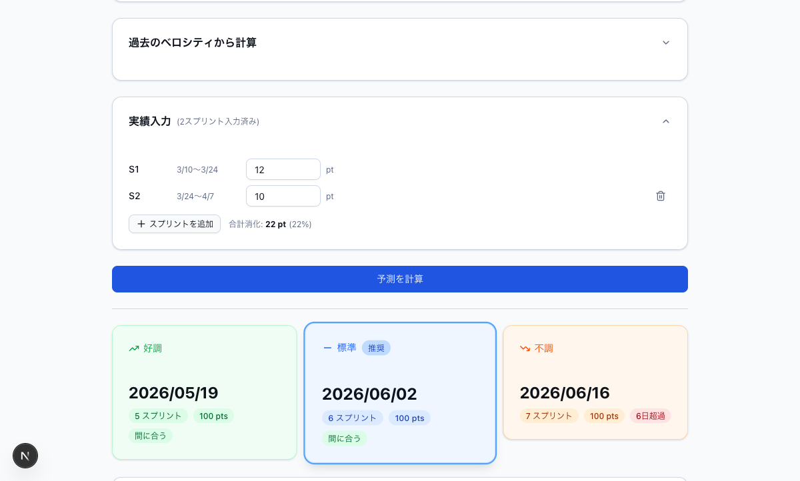
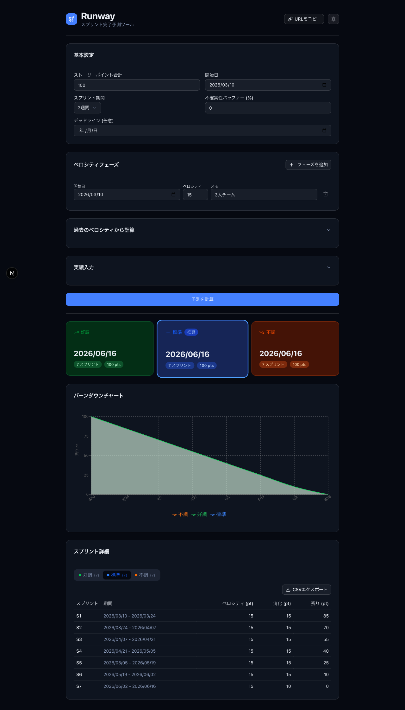
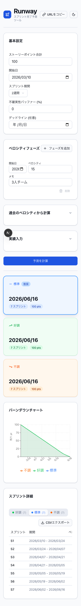

# Runway

スプリント完了予測ツール。チームのベロシティとバックログの残ストーリーポイントから、開発完了時期を予測する。



## 機能

- **3シナリオ予測** - 楽観・標準・悲観の完了日を同時に表示
- **ベロシティフェーズ設定** - 日付ベースでベロシティを変化させる（人員増減対応）
- **過去ベロシティ入力** - 過去スプリントの実績を入力して平均値を自動計算・適用
- **実績スプリント入力** - 消化済みスプリントの実績ポイントを入力してバーンダウンに反映
- **バーンダウンチャート** - 楽観・標準・悲観の3ラインをrecharts で描画
- **スプリント別詳細テーブル** - 各スプリントの期間・消化ポイント・残ポイントを一覧表示
- **EVM 指標** - 実績入力に基づく SPI, SV, TCPI, EAC を自動計算・表示
- **URLシェア機能** - 入力状態をURLにエンコードして共有
- **入力状態の永続化** - LocalStorage に保存してページ再読み込み後も維持
- **ダークモード対応**

## スクリーンショット

### 予測結果（3シナリオ）

バックログの残ポイントとベロシティから、楽観・標準・悲観の3パターンで完了日を予測する。


### ベロシティフェーズ設定

人員増減など、期間ごとに異なるベロシティを設定できる。



### 実績スプリント入力

実際に消化したスプリントの結果を入力すると、バーンダウンチャートに実績ラインが表示される。



### デッドライン設定

デッドラインを設定すると、各シナリオで「間に合う」「X日超過」のバッジが表示される。



### ダークモード

システム設定に関わらず、手動でダーク/ライトモードを切り替えられる。



### モバイル対応

375px幅のスマートフォン画面でも適切にレイアウトされる。



## Tech Stack

- Next.js 16 (App Router) + TypeScript
- shadcn/ui + Tailwind CSS v4
- recharts
- date-fns
- Jest + ts-jest + Testing Library

## セットアップ

```bash
git clone <repository-url>
cd runway
npm install
npm run dev
```

ブラウザで http://localhost:3000 を開く。

## 開発コマンド

| コマンド | 説明 |
|---|---|
| `npm run dev` | 開発サーバー起動 (localhost:3000) |
| `npm run build` | プロダクションビルド |
| `npm test` | Jest テスト実行 |
| `npm test -- --testPathPattern=forecast` | 特定テストファイルのみ実行 |
| `npm run lint` | ESLint 実行 |

## アーキテクチャ

```
src/
  app/
    page.tsx            # メインページ: 全状態管理、子コンポーネントのオーケストレーション
    layout.tsx          # ルートレイアウト
    globals.css         # Tailwind + shadcn CSS 変数
    __tests__/page.test.tsx
  components/
    ui/                 # shadcn/ui プリミティブ (button, card, input など)
    forecast-form.tsx   # 基本入力 (totalPoints, startDate, sprintDays, bufferPercent, deadline)
    velocity-phases.tsx # ベロシティフェーズ設定（日付ベース、動的追加/削除）
    velocity-history.tsx # 過去スプリントのベロシティ → 平均値計算 → フェーズ1に適用
    completed-sprints.tsx # 実績スプリント入力（バーンダウン実績線に使用）
    forecast-result.tsx # 3シナリオ完了日カード（デッドラインバッジ付き）
    burndown-chart.tsx  # バーンダウンチャート (recharts) — dynamic() で SSR 無効化
    sprint-table.tsx    # スプリント別詳細テーブル（CSV エクスポート対応）
    evm-indicators.tsx  # EVM 指標カード（SPI, SV, TCPI など）
    theme-toggle.tsx    # ダーク/ライトモード切り替え
  lib/
    types.ts            # コア型定義 (ForecastInput, ForecastResult, Scenario, EvmMetrics)
    forecast.ts         # 純粋な計算ロジック (calculateForecast, buildActualBurndown など)
    evm.ts              # EVM 指標計算 (calculateEvmMetrics)
    storage.ts          # localStorage 永続化 (saveState / loadState)
    share.ts            # URL シェア: encodeState / decodeState (URL-safe base64)
    export.ts           # CSV エクスポート: toCsv / downloadCsv
    velocity-stats.ts   # 統計ヘルパー (average, stdDev, CV)
    utils.ts            # cn() ヘルパー (shadcn), roundPt()
    __tests__/          # 全 lib モジュールのユニットテスト
  hooks/
    use-theme.ts        # ダークモード状態フック
```

### 主要パターン

- **状態フロー**: `page.tsx` が全状態（`formData`, `phases`, `completedSprintForms`, `result`）を管理。子コンポーネントはデータと onChange コールバックを受け取る。
- **フォームデータとドメイン型**: フォーム入力は文字列（例: `PhaseFormData.velocity: string`）。`page.tsx` が `useMemo` で `calculateForecast` に渡す前にドメイン型（`VelocityPhase.velocity: number`）に変換する。
- **BurndownChart SSR**: recharts がブラウザ DOM を必要とするため `dynamic(..., { ssr: false })` でロード。
- **状態永続化**: 状態変更のたびに `saveState()` で localStorage に保存。マウント時に URL パラメータ `?s=` を優先して確認し、なければ localStorage を参照。
- **バッファ**: `bufferPercent` がベロシティを ±N% スケールして楽観/悲観シナリオ（`highVelocity` / `lowVelocity`）を生成。

## ドメイン用語

| 用語 | 説明 |
|---|---|
| Story Point | タスクの相対的な見積もり単位 |
| Velocity | チームが1スプリントで消化できるストーリーポイントの平均値 |
| Sprint | 固定期間の開発イテレーション（通常1〜4週間） |
| Runway | 残バックログをベロシティで割った、完了までの予測スプリント数 |
| Burndown | 残ポイントの時系列推移 |
| VelocityPhase | 日付ベースのベロシティ変化（人員増減等） |
| Scenario | 楽観/標準/悲観の3パターン予測（`highVelocity` / `standard` / `lowVelocity`） |
| CompletedSprint | 実績入力済みスプリント（バーンダウン実績線に使用） |
| EVM | Earned Value Management。実績と計画の乖離を定量的に把握する手法 |
| SPI | Schedule Performance Index。進捗効率（1.0 以上で計画通り） |
| SV | Schedule Variance。計画との差異ポイント数 |
| TCPI | To-Complete Performance Index。残作業に必要な効率 |
